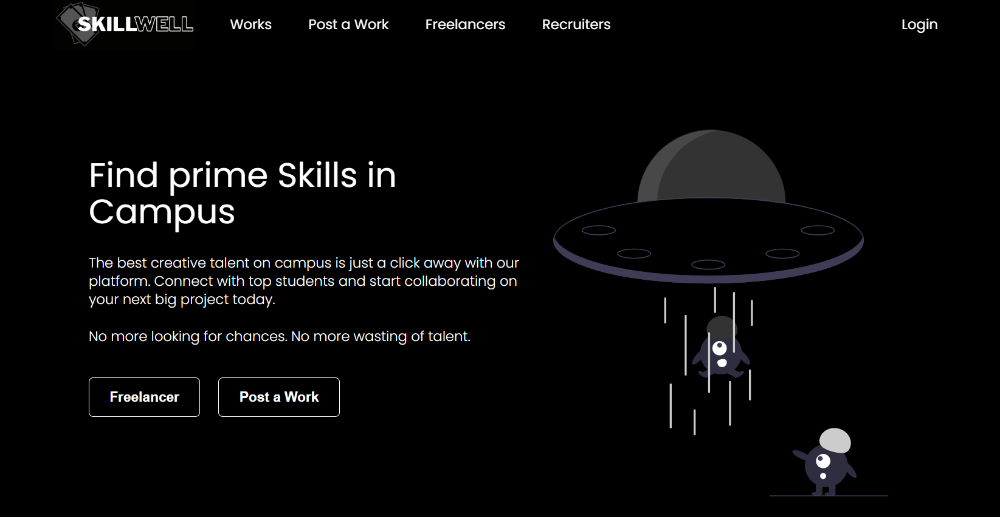
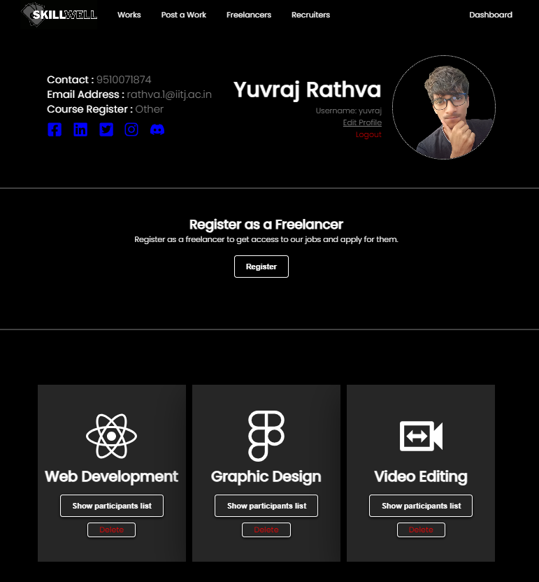
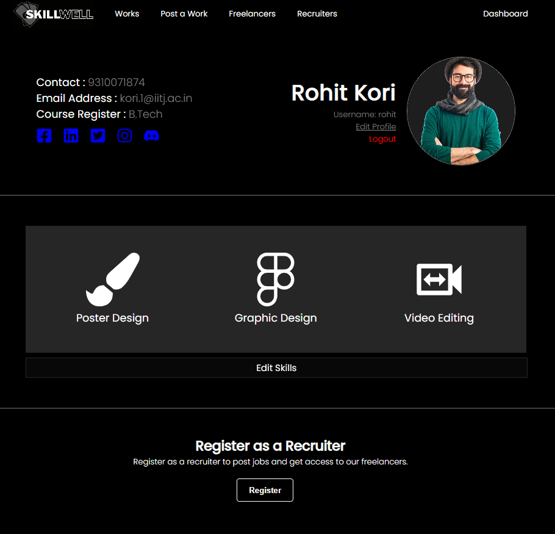
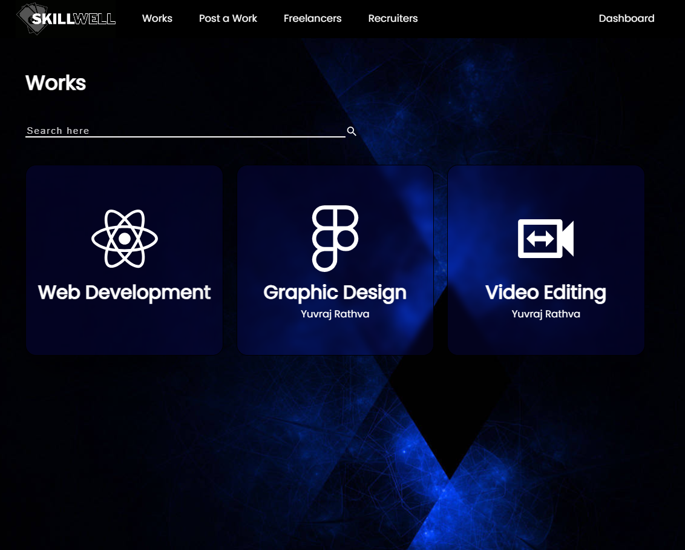
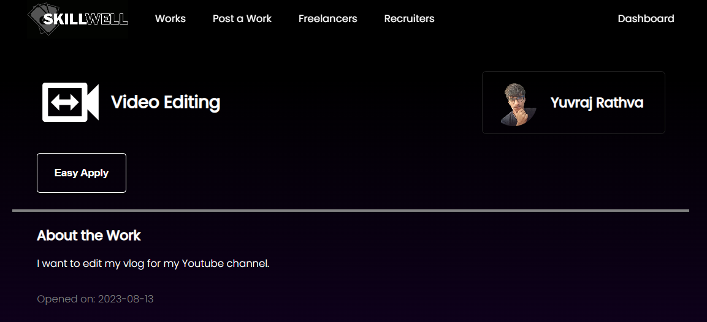
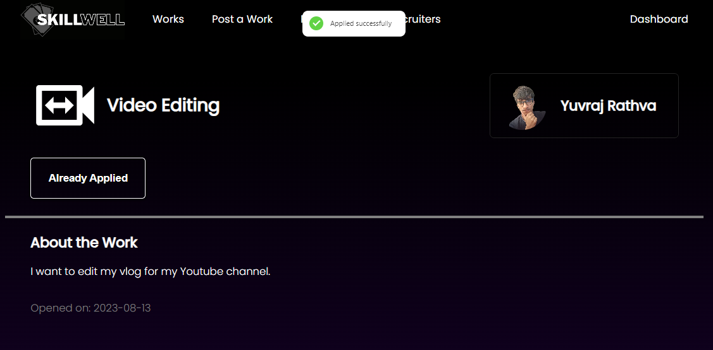
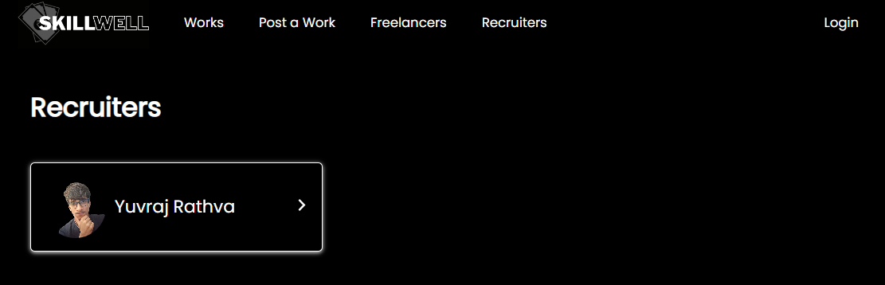
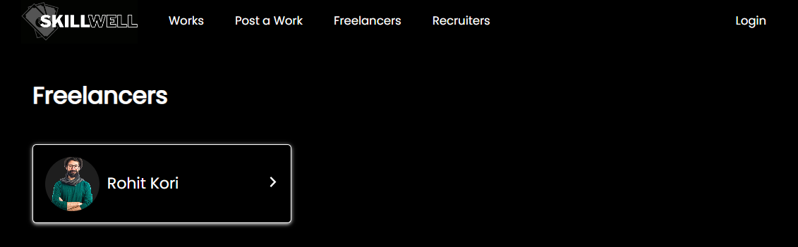

# SkillWell
The best creative talent on campus is just a click away with our platform. Connect with top students and start collaborating on your next big project today.

## Table of Contents

- [ScreenShots](#screenshots)
- [Installation](#installation)
- [Usage](#usage)
- [Technologies](#technologies)

## ScreenShots
<table>
   <tr>
      <td>
         <div style="display: flex; flex-direction: column;" align="center">
            
            <h2>Homepage</span>
         </div>
      </td>
   </tr>
</table>
<table>
   <tr>
      <td>
         <div align="center">
            
            <h2>Recruiter Dashboard</h2>
         </div>
      </td>
      <td>
         <div align="center">
            
            <h2>Freelancer Dashboard</h2>
         </div>
      </td>
   </tr>
</table>
<table>
   <tr>
      <td>
         <div style="display: flex; flex-direction: row;" align="center">
            
            <h2>Works Page</h2>
         </div>
      </td>
   </tr>
</table>
<table>
   <tr>
      <td>
         <div align="center">
            
            <h2>Work Details Page</h2>
         </div>
      </td>
      <td>
         <div align="center">
            
            <h2>Work Applied</h2>
         </div>
      </td>
   </tr>
</table>
<table>
   <tr>
      <td>
         <div align="center">
            
            <h2>Recruiters Page</h2>
         </div>
      </td>
      <td>
         <div align="center">
            
            <h2>Freelancers Page</h2>
         </div>
      </td>
   </tr>
</table>

## Installation

1. Install dependencies for the frontend.
   ```sh
   cd frontend
   npm install
   ```
2. Install dependencies for the backend.
   ```sh
   cd ../backend
   pipenv shell
   pipenv install
   ```
3. Create a `.env` file in the `backend` directory with the following variables:
   ```
   DEBUG=True
   SECRET_KEY=your-secret-key
   ```
4. Run migrations to create the database tables.
   ```sh
   python manage.py makemigrations
   python manage.py migrate
   ```
5. Create a superuser to access the admin interface.
   ```sh
   python manage.py createsuperuser
   ```

## Usage

1. Start the backend server.
   ```sh
   cd backend
   python manage.py runserver
   ```
2. Start the frontend server.
   ```sh
   cd frontend
   npm start
   ```
3. Access the application at `http://localhost:3000/`.

4. Access using Docker by running
   `docker-compose up --build`

## Technologies

- React
- Django
- PostgreSQL
- HTML
- CSS
- JavaScript
- Docker

## Deployed Link

- [Skillwell](https://skillwell.vercel.app/)
